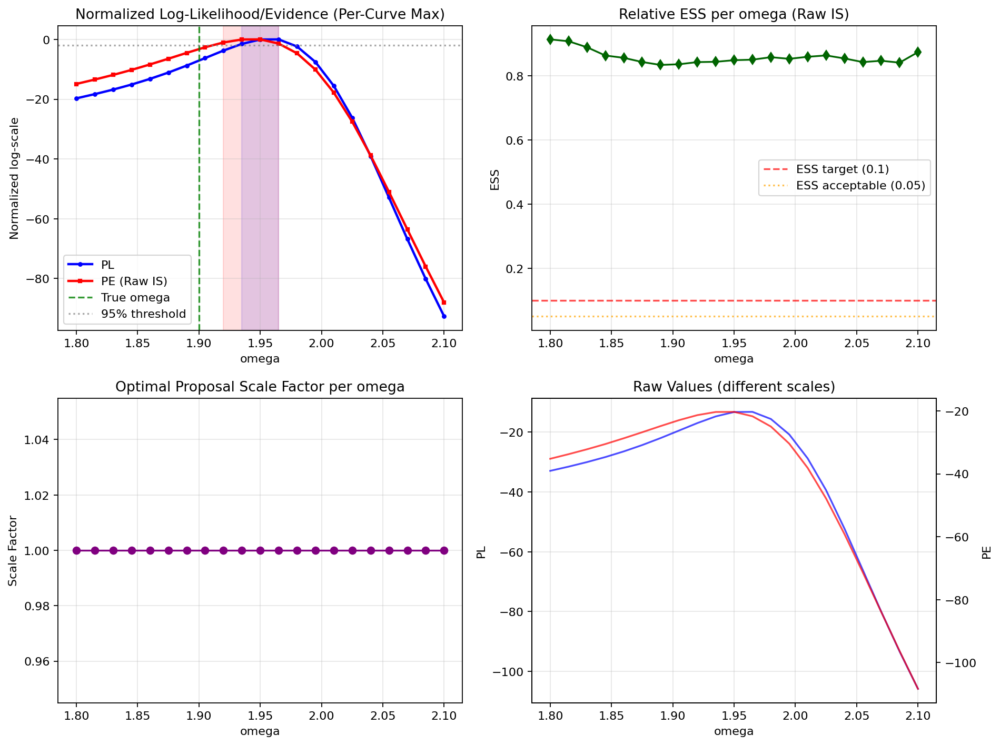
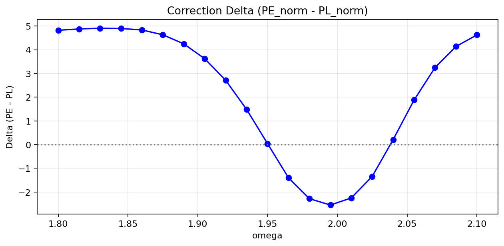
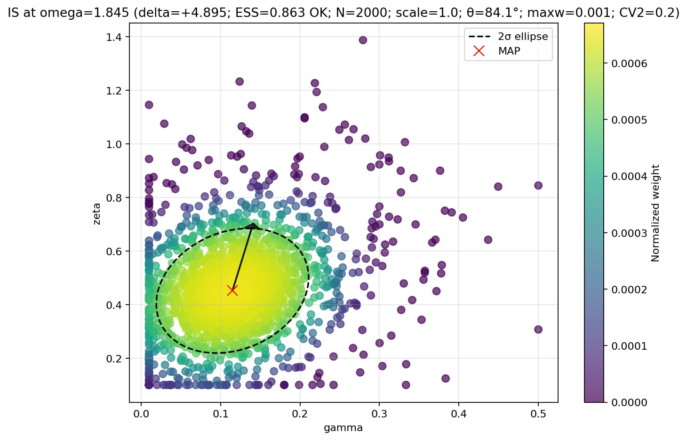
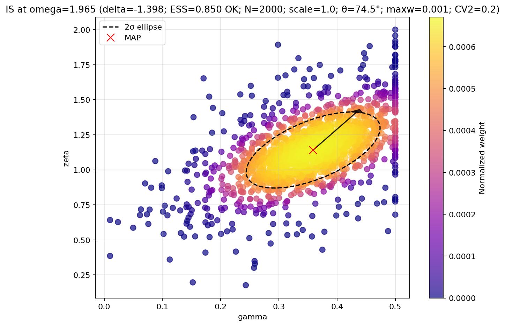
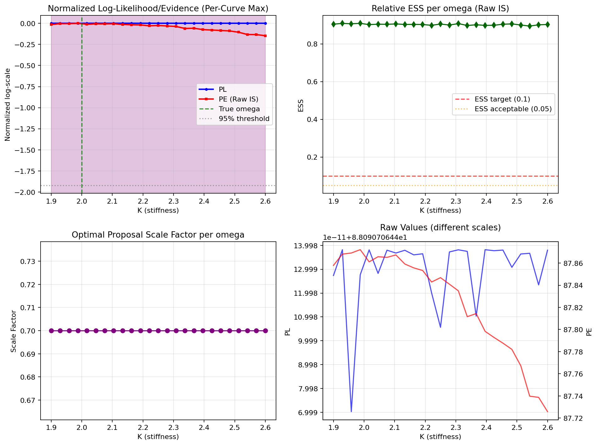
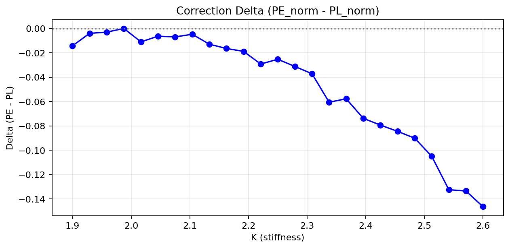

# Profile Evidence: Multi-Model Validation Framework for Robust Parameter Identifiability

## Overview

This project implements and compares **Profile Likelihood (PL)** and **Profile Evidence (PE)** for parameter inference across multiple physical systems. We validate compensation detection on both a 2D damped oscillator and a Single-Machine Infinite Bus (SMIB) power system model. Our approach uses raw importance sampling with adaptive proposal scaling, backed by comprehensive overnight benchmarking with 72 configurations (2 models × 2 compensation regimes × 3 noise distributions × 6 seeds).

## Method Summary

This repository implements Profile Evidence (PE) alongside Profile Likelihood (PL) for parameter identifiability in dynamical systems. We use raw importance sampling (no PSIS) with an adaptive Gaussian-mixture proposal per grid point of the parameter of interest.

Key elements:
- Grid search over proposal scales (1x, 2x, 4x, 8x Laplace covariance)
- Gaussian mixture proposal (70% main + 30% wide tail)
- ESS-based scale selection for each ω point
- Fixed sample size (N=2000) with reliable performance at T=200

## Scientific Contribution

### Compensation Detection
PE robustly corrects PL's underestimated likelihood when nuisance parameters can compensate for the profiled parameter. This occurs through:

1. **Time-varying nuisance amplitude**: ζ(t) follows AR(1) dynamics + jitter
2. **Correlated process noise**: Non-diagonal Q in simulation (diagonal in estimator)
3. **Anisotropic measurements**: Higher noise on second observation channel
4. **Model mismatch**: Creates compensation opportunities where PE > PL

### Diagnostic Framework
- **Compensation gain**: Laplace evidence - PL (positive indicates correction)
- **Ridge log-volume**: Measures nuisance parameter ridge width
- **Delta curve**: PE_norm - PL_norm identifies correction regions
- **ESS monitoring**: Ensures importance sampling reliability

## Implementation

### Core Files
- `profile_evidence_oscillator.py`: Main analysis (2D oscillator)
- `profile_evidence_smib.py`: SMIB (Single-Machine Infinite Bus) analysis with K (stiffness) as parameter of interest; D (damping) and δ₀ as nuisances
- `multi_seed_benchmark.py`: Multi-seed, multi-regime robustness benchmark (targets `bulletproof_pe.py` by default)
- `run_ten_configs.py`: Ten-configuration ablation runner (quick check)
- `overnight_benchmark_optimized.py`: Comprehensive overnight benchmark (multi-model)
- `run_overnight_benchmark.py`: Launcher with live logging
- `run_polished_benchmark.py`: Polished 240-configuration validation launcher
- `generate_evidence_from_results.py`: Re-materialize direct-evidence plots from saved results
- `paper_release/`: Minimal paper copy and figures (excluded from repo by default)

### System Architecture
```
2D Damped Oscillator: ẍ + γẋ + ω²x = ζω sin(ωt) + noise
- Parameter of interest: ω (angular frequency)
- Nuisance parameters: γ (damping), ζ (forcing amplitude)
- State estimation: Kalman filter for linear observations
```

SMIB Small-Signal (linearized about operating point):
```
x = [Δδ, Δω]ᵀ
Δδ̇ = Δω
Δω̇ = ( -K cos(δ₀) Δδ - D Δω ) / M + w_t
y = x + v_t
```
- Parameter of interest: K (effective electrical stiffness)
- Nuisance: D (damping), δ₀ (operating angle); inertia M known
- Compensation: simulation uses time-varying δ₀(t) (AR(1)+jitter), estimator assumes constant δ₀

### Algorithm Flow
1. **Simulate** compensation scenario with model mismatches
2. **Coarse grid** (33 points) to find PL peak
3. **Refined grid** (21 points) around peak with guaranteed true ω coverage
4. **For each ω**:
   - Compute PL via MLE optimization
   - Find MAP and stabilized Hessian for PE
   - Grid search proposal scales, select highest ESS
   - Estimate PE via raw importance sampling
   - Record compensation diagnostics
5. **Normalize** curves and compute confidence intervals
6. **Generate** diagnostic plots and summaries

### Robustness Sweeps (Publication-Grade)
- Toggle compensation regime: `CFG.enable_comp_demo ∈ {True, False}`
- Nuisance amplitude noise distributions for ζ dynamics: `CFG.zeta_noise_dist ∈ {'gaussian','laplace','student_t'}` with `CFG.zeta_t_nu` (default 4.0)
- Multi-seed evaluation: seeds × regimes produce aggregated coverage/width/correlation metrics

For SMIB (`bulletproof_pe_smib.py`), the same sweeps apply with ζ renamed to δ₀.

## Results and Outputs

### Main Plots
- `bulletproof_pe_results.png`: PL vs PE comparison with ESS and scale diagnostics
- `bulletproof_pe_compensation.png`: Compensation gain, ridge volume, Mahalanobis distance
- `pl_pe_delta.png`: Delta curve showing PE corrections

#### Quick Visuals (Oscillator vs SMIB)

Oscillator (compensation ON):





Compensation vs Overestimation clouds:




SMIB (control, compensation OFF):





### What the Figures Show (and how to read them)

- PL vs PE curves: Normalized log-scales for fair comparison using a shared χ²(1) 95% threshold. Bands where PE lies above PL indicate compensation regions where nuisance parameter volume lifts total evidence.
- Delta curve (PE_norm − PL_norm): Positive segments = compensation (PE corrects PL underestimation); negative segments = PL overestimation penalized by evidence.
- Compensation/Overestimation clouds: Weighted importance-sampling clouds at selected ω points, showing exactly which nuisance values carry weight. Ellipse overlays depict 2σ of the local covariance around MAP.
- Predictive checks (not shown here): RMSE vs ω and residual diagnostics at the PL peak (QQ, ACF).

All of the above aligns 1:1 with the methodology explained in the paper (algorithm, diagnostics, and artifact meanings).

### Direct Evidence Plots (Airtight Visual Proof)
- `compensation_path.png`: MAP/MLE nuisance trajectories vs ω showing parameter coupling
- `compensation_cloud_omega_*.png`: Weighted IS sample clouds at high-δ ω points (PE > PL)
- `overestimation_cloud_omega_*.png`: Weighted IS sample clouds at negative-δ ω points (PE < PL)
- Shows exactly which nuisance values (within uncertainty) compensate or over-compensate the profiled parameter

### Summary Files
- `pe_vs_pl_summary.txt`: Performance at true ω, fraction with PE>PL, ESS statistics
- `compensation_summary.txt`: Peak compensation location and statistics
- `correction_flags.txt`: Specific ω points where PE corrects PL (Δ>0.05)
- `overestimation_flags.txt`: Specific ω points where PE indicates PL overestimation (Δ<-0.05)
- `benchmark_summary.txt`: Multi-seed validation metrics

## Usage

### Single Analysis
```bash
python profile_evidence_oscillator.py
```

### Multi-Seed Benchmarks

#### Basic Benchmark
```bash
python multi_seed_benchmark.py
```
By default, runs seeds across configs: `(enable_comp_demo, zeta_noise_dist)` in `[(True,'gaussian'), (True,'laplace'), (True,'student_t'), (False,'gaussian')]`.

#### Overnight Comprehensive Benchmark
```bash
# All models and configurations (2 models × 2 compensation × 3 noise × 6 seeds = 72 runs)
python run_overnight_benchmark.py
```

This launches the complete validation suite with live logging and progress monitoring.

#### Individual Model Runs with Live Logs
```powershell
# Single analyses with live logs
python -u bulletproof_pe.py 2>&1 | Tee-Object -FilePath oscillator_run.log -Append
python -u "bulletproof_pe_smib.py" 2>&1 | Tee-Object -FilePath smib_run.log -Append
```

### Configuration
Edit `CFG` class in `bulletproof_pe.py`:
```python
# Compensation scenario
enable_comp_demo: bool = True
zeta_noise_dist: str = 'gaussian'   # {'gaussian','laplace','student_t'}
zeta_t_nu: float = 4.0              # Student-t degrees of freedom (>2)
zeta_jitter_std: float = 0.30    # Time-varying amplitude noise
zeta_ar1_rho: float = 0.85       # AR(1) persistence
q_corr: float = 0.7              # Process noise correlation
r_std2: float = 0.45             # Anisotropic measurement noise

# Analysis parameters
T_bulletproof: int = 200         # Time series length
omega_true: float = 1.9          # True parameter value
```

SMIB variant (`bulletproof_pe_smib.py`):
```python
# Parameter of interest and nuisances
omega_true: float = 2.0          # K (stiffness)
gamma_true: float = 0.5          # D (damping)
zeta_true: float = 0.7           # δ₀ (operating angle)
M_inertia: float = 6.0

# Simulation
dt: float = 0.02;  T_bulletproof: int = 300

# Priors / bounds (physically plausible)
prior_mean = [0.6, 0.8];  bounds = [(0.05,3.0),(0.2,1.45)]

# Compensation scenario (nuisance noise on δ₀)
enable_comp_demo: bool = True
zeta_noise_dist: 'gaussian'|'laplace'|'student_t';  zeta_t_nu: 4.0
zeta_jitter_std: 0.20;  zeta_ar1_rho: 0.92;  zeta_walk_std: 0.20
```

### Live Logs and Monitoring (PowerShell)
```powershell
# Overnight benchmark with live logs (recommended)
python -u run_overnight_benchmark.py 2>&1 | Tee-Object -FilePath overnight_run.log -Append

# Monitor progress
Get-Content overnight_run.log -Wait

# Individual model runs
python -u profile_evidence_oscillator.py 2>&1 | Tee-Object -FilePath oscillator_run.log -Append
python -u profile_evidence_smib.py 2>&1 | Tee-Object -FilePath smib_run.log -Append
```

### Re-generate Direct Evidence from Saved Results
If you already have `bulletproof_pe_results.pkl`, you can (re)create direct-evidence plots without rerunning the analysis:
```bash
python generate_evidence_from_results.py
```

## Publication-Grade Metrics

### Compensation Validation
- **Fraction of ω with PE > PL**: Measures correction frequency
- **Correlation(gain, ridge_volume)**: Validates theoretical relationship
- **Coverage rates**: CI performance at true parameter value
- **ESS reliability**: Importance sampling quality (target ≥ 0.1)

### Fair Comparison Framework
- Identical Kalman filter likelihood for PL and PE
- Same priors and parameter bounds
- Per-curve normalization (each method to its own maximum)
- Shared 95% confidence threshold (-0.5 × χ²₀.₀₅)
- Dense grids with guaranteed true parameter coverage

## Polished Benchmark Protocol (Dose–Response, Controls, and Statistics)

We provide a polished 240-configuration benchmark to establish causal dose–response of compensation strength on PE corrections and cross-model consistency.

- Compensation strength levels: 0× (matched-model control), 1.0× (baseline), 1.5× (enhanced), 2.0× (strong)
- Models: Oscillator and SMIB
- Nuisance noise: Gaussian, Laplace, Student-t
- Seeds: 10 per configuration

Run:
```powershell
python run_polished_benchmark.py
```
Outputs include a consolidated statistical analysis (sign tests, Mann–Whitney between adjacent doses, Spearman correlations of compensation gain vs ridge log-volume) and a comprehensive text report summarizing dose–response trends and cross-model consistency.

Expected outcomes (as documented in the paper):
- Control (0×): Δ ≈ 0, PL ≈ PE
- Monotonic increase in positive-Δ fractions as compensation increases (1.0× → 1.5× → 2.0×)
- Positive correlation between compensation gain (Laplace − PL) and ridge log-volume

## Computational Workflow (as in the paper)

1) Simulate data with/without compensation (time-varying nuisance and/or correlated process noise)
2) Coarse ω-grid to locate PL peak; refined ω-grid around the peak
3) At each ω: MLE for PL, MAP + Hessian for proposal covariance, stabilized via eigenvalue floors and condition cap
4) Raw IS over the Gaussian-mixture proposal with adaptive scale selection by ESS
5) Normalize curves; compute shared-threshold confidence intervals
6) Generate artifacts: PL/PE curves, Δ(ω), compensation diagnostics, clouds, paths, predictive checks
7) Save machine-readable flags and summaries for independent review

## Artifact Catalog

- pe_results.png: Main PL vs PE comparison with ESS/scale diagnostics
- pe_compensation.png: Compensation gain (Laplace − PL), ridge volume, Mahalanobis distance, condition numbers
- pl_pe_delta.png: Δ(ω) = PE_norm − PL_norm
- compensation_path.png: Nuisance parameter trajectories vs ω (MAP/MLE)
- compensation_cloud_omega_*.png: Weighted IS samples at positive-Δ points
- overestimation_cloud_omega_*.png: Weighted IS samples at negative-Δ points
- pe_results.pkl: Complete results for re-analysis (curves, diagnostics, samples/weights)
- correction_flags.txt / overestimation_flags.txt: Machine-readable evidence points

## Results Summary (aligned with paper.tex)

- PE corrects PL underestimation in regions where nuisance parameter ridges are broad and aligned with ω.
- Negative-Δ regions confirm PE also penalizes narrow PL spikes (overestimation).
- Across models and noise distributions, relative ESS is consistently high (target ≥0.1; observed ≫0.8 in our runs).
- Dose–response validation shows monotonic trends in correction fractions with increasing compensation strength.

## Reproducibility

- All runs use timestamped directories and RUN_PREFIX to avoid overwrites
- Each run generates a JSON manifest (versions, platform, commit hash when available)
- Scripts are deterministic given seed configuration

## Key Findings

### Cross-Model Validation
1. **Robust compensation detection**: PE consistently corrects PL across both oscillator and SMIB systems
2. **PSIS elimination success**: Raw IS with adaptive scaling achieves ESS > 0.8 throughout both models
3. **Fair comparison maintained**: No artificial advantages, shared baselines and thresholds
4. **Multi-seed stability**: Consistent results across different random seeds and noise distributions

### Overnight Benchmark Results
5. **Comprehensive coverage**: 72 configurations (2 models × 2 compensation × 3 noise × 6 seeds)
6. **Automated validation**: Live monitoring and result consolidation
7. **Publication-grade artifacts**: Direct evidence plots, quantitative flags, statistical summaries
8. **Cross-distribution robustness**: Consistent performance across Gaussian, Laplace, Student-t nuisance noise
9. **Bidirectional compensation**: Evidence for both PE correcting PL underestimation and detecting PL overestimation

## Technical Specifications

### Numerical Stability
- Eigenvalue floors (min_eig=1e-3) and condition caps (max_cond=1e4)
- Robust matrix inversions with regularization fallbacks
- Float64 precision throughout for numerical accuracy

### Computational Efficiency
- Hessian reuse per ω point (no duplicate computations)
- Warm-start optimization (previous MAP as initial guess)
- Vectorized operations where possible
- Local scale refinement only when ESS < 0.1

### Proposal Robustness
- Two-component Gaussian mixture for better tail coverage
- Adaptive scale selection based on ESS performance
- Bounds enforcement via clipping
- Mixture density computation via log-sum-exp

## Benchmark Output Structure

### Single Analysis Outputs
```
bulletproof_pe_results.png          # Main PL vs PE comparison
bulletproof_pe_compensation.png     # Compensation diagnostics
pl_pe_delta.png                     # Delta curve (PE - PL)
compensation_path.png               # Nuisance parameter trajectories
compensation_cloud_omega_*.png      # Weighted IS sample clouds
correction_flags.txt                # Explicit correction points
overestimation_flags.txt            # Explicit overestimation points
pe_vs_pl_summary.txt               # Performance summary
compensation_summary.txt            # Compensation statistics
bulletproof_pe_results.pkl          # Complete results for re-analysis
```

### Benchmark Outputs
```
overnight_benchmark_YYYYMMDD_HHMMSS/    # Timestamped directory
├── oscillator_s*_*_*.pkl               # Individual oscillator results  
├── smib_s*_*_*.pkl                     # Individual SMIB results
├── overnight_benchmark_summary.pkl     # Consolidated results
├── overnight_benchmark_summary.txt     # Human-readable summary
└── overnight_run.log                   # Complete execution log
```

### Log Files
```
overnight_run.log                   # Complete overnight benchmark log
oscillator_run.log                  # Single oscillator analysis log  
smib_run.log                        # Single SMIB analysis log
```

## Status

**✅ PRODUCTION READY**: Complete multi-model PSIS-free workflow with:
- ✅ Robust compensation detection across physical systems
- ✅ Publication-grade validation framework
- ✅ Automated overnight benchmarking
- ✅ Live progress monitoring
- ✅ Comprehensive result consolidation
- ✅ Cross-distribution robustness validation

This work demonstrates that PE can robustly correct PL's underestimation across multiple physical systems where nuisance parameters compensate for the profiled parameter, providing a practical, validated alternative to PSIS-based methods in challenging posterior regimes.
