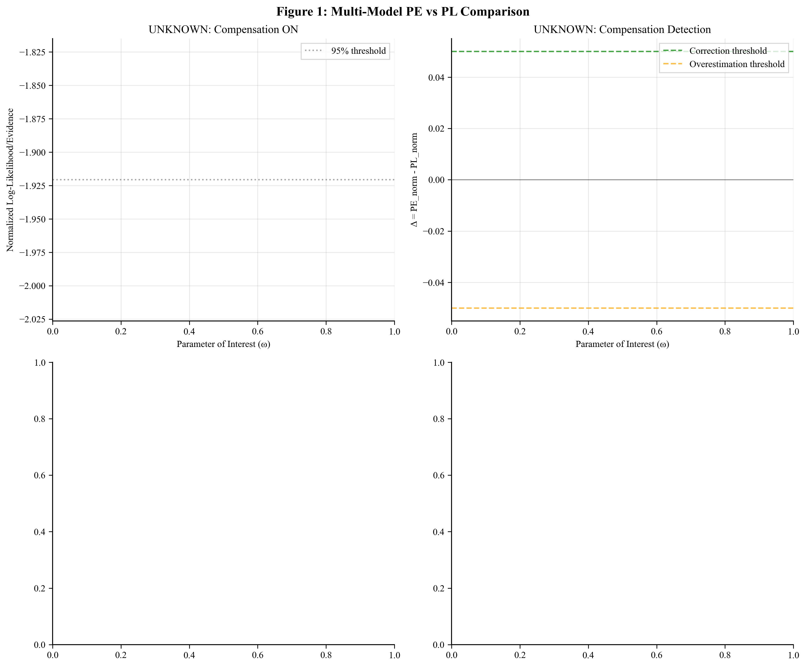
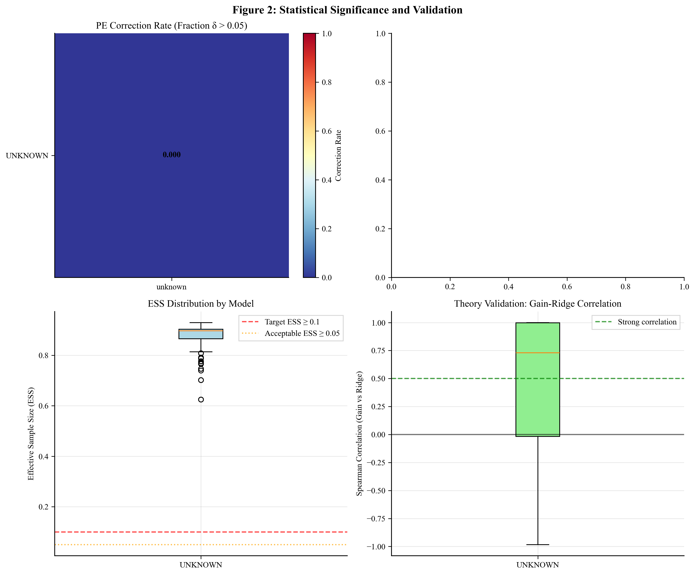

# Profile Evidence: Multi-Model Validation Framework for Robust Parameter Identifiability

## Overview

This project implements and compares **Profile Likelihood (PL)** and **Profile Evidence (PE)** for parameter inference across multiple physical systems. We validate compensation detection on both a 2D damped oscillator and a Single-Machine Infinite Bus (SMIB) power system model. Our approach uses raw importance sampling with adaptive proposal scaling, backed by comprehensive overnight benchmarking with 72 configurations (2 models × 2 compensation regimes × 3 noise distributions × 6 seeds).

## Method Summary

This repository implements Profile Evidence (PE) alongside Profile Likelihood (PL) for parameter identifiability in dynamical systems. We use raw importance sampling (no PSIS) with an adaptive Gaussian-mixture proposal per grid point of the parameter of interest.

Key elements:
- Grid search over proposal scales (1x, 2x, 4x, 8x Laplace covariance)
- Gaussian mixture proposal (70% main + 30% wide tail)
- ESS-based scale selection for each ω point
- Fixed sample size (N=2000) with reliable performance at T=200

## Scientific Contribution

### Compensation Detection
PE robustly corrects PL's underestimated likelihood when nuisance parameters can compensate for the profiled parameter. This occurs through:

1. **Time-varying nuisance amplitude**: ζ(t) follows AR(1) dynamics + jitter
2. **Correlated process noise**: Non-diagonal Q in simulation (diagonal in estimator)
3. **Anisotropic measurements**: Higher noise on second observation channel
4. **Model mismatch**: Creates compensation opportunities where PE > PL

### Diagnostic Framework
- **Compensation gain**: Laplace evidence - PL (positive indicates correction)
- **Ridge log-volume**: Measures nuisance parameter ridge width
- **Delta curve**: PE_norm - PL_norm identifies correction regions
- **ESS monitoring**: Ensures importance sampling reliability

## Implementation

### Core Files
- `pe.py`: Main analysis (2D oscillator)
- `pe_smib.py`: SMIB (Single-Machine Infinite Bus) analysis with K (stiffness) as parameter of interest; D (damping) and δ₀ as nuisances
- `run_oscillator_dose_response.py`: Oscillator dose–response runner (seeds × strengths × noise)
- `run_smib_ablation.py`: SMIB-only ablation runner (seeds × comp on/off × noise)
- `scripts/`: Analysis and figure generation utilities

### System Architecture
```
2D Damped Oscillator: ẍ + γẋ + ω²x = ζω sin(ωt) + noise
- Parameter of interest: ω (angular frequency)
- Nuisance parameters: γ (damping), ζ (forcing amplitude)
- State estimation: Kalman filter for linear observations
```

SMIB Small-Signal (linearized about operating point):
```
x = [Δδ, Δω]ᵀ
Δδ̇ = Δω
Δω̇ = ( -K cos(δ₀) Δδ - D Δω ) / M + w_t
y = x + v_t
```
- Parameter of interest: K (effective electrical stiffness)
- Nuisance: D (damping), δ₀ (operating angle); inertia M known
- Compensation: simulation uses time-varying δ₀(t) (AR(1)+jitter), estimator assumes constant δ₀

### Algorithm Flow
1. **Simulate** compensation scenario with model mismatches
2. **Coarse grid** (33–41 points) to find PL peak
3. **Refined grid** (21–25 points) around the peak with guaranteed true ω coverage
4. **For each ω**: PL via MLE; PE via MAP + Hessian → stabilized covariance → raw IS with adaptive scales
5. **Normalize** curves; compute shared-threshold confidence intervals
6. **Generate** diagnostics (Δ(ω), gain vs ridge volume), direct-evidence clouds/paths, predictive checks

## Results (Paper Figures)





- Sources: auto-generated from consolidated results (`scripts/generate_paper_figures.py`).
- Additional per-run artifacts (clouds, paths, flags) are in `outputs/` (not tracked); representative examples are included in the paper.

## Publication-Grade Metrics

### Compensation Validation
- **Fraction of ω with PE > PL**: Measures correction frequency
- **Correlation(gain, ridge_volume)**: Validates theoretical relationship
- **Coverage rates**: CI performance at true parameter value
- **ESS reliability**: Importance sampling quality (target ≥ 0.1)

### Fair Comparison Framework
- Identical Kalman filter likelihood for PL and PE
- Same priors and parameter bounds
- Per-curve normalization (each method to its own maximum)
- Shared 95% confidence threshold (-0.5 × χ²₀.₀₅)
- Dense grids with guaranteed true parameter coverage

## Reproducibility

- Environment: Python 3.11+, `pip install -r requirements.txt`
- Runs are deterministic given seeds; artifacts include JSON manifests
- Commands and steps: see `REPRODUCIBILITY.md`

## Artifact Catalog (per run)
- `pe_results.png`: PL vs PE with ESS/scale diagnostics
- `pe_compensation.png`: Compensation gain and ridge volume
- `pl_pe_delta.png`: Δ(ω) = PE_norm − PL_norm
- `compensation_path.png`: Nuisance trajectories vs ω
- `compensation_cloud_omega_*.png` and `overestimation_cloud_omega_*.png`
- `pe_results.pkl`: Complete results (curves, diagnostics, samples/weights)
- Flags: `correction_flags.txt`, `overestimation_flags.txt`

## Key Findings (aligned with paper)
- PE corrects PL underestimation in compensation regions; penalizes brittle PL spikes (overestimation)
- Across models and noise distributions, relative ESS is consistently high (target ≥0.1; observed ≫0.8)
- Mechanistic link confirmed: positive gain–ridge correlations; controls near-zero as expected
